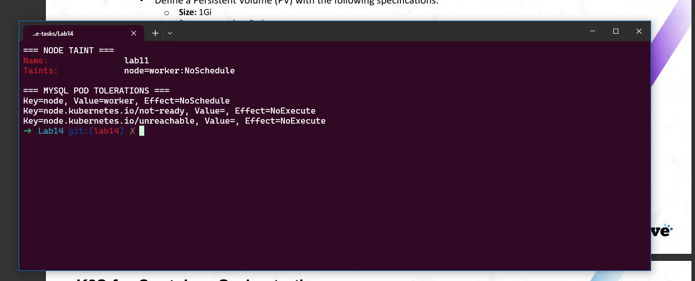
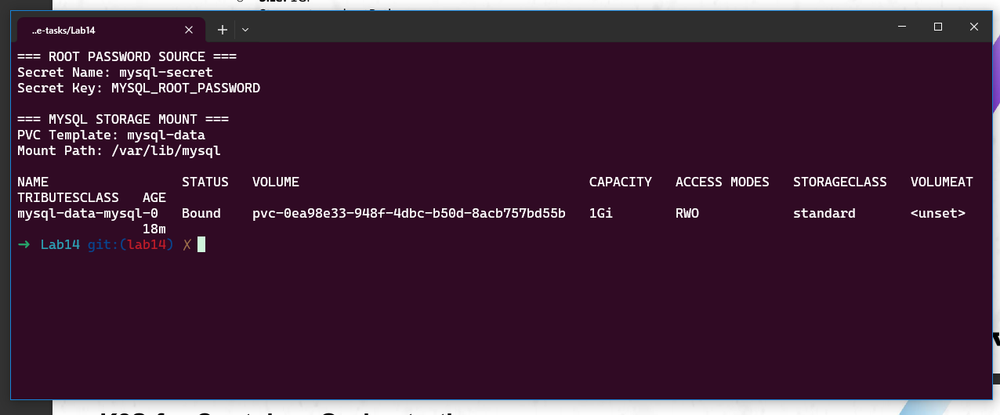
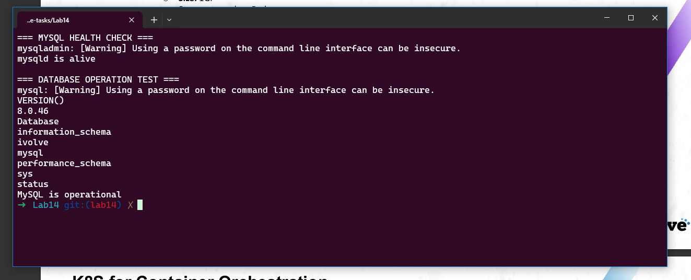
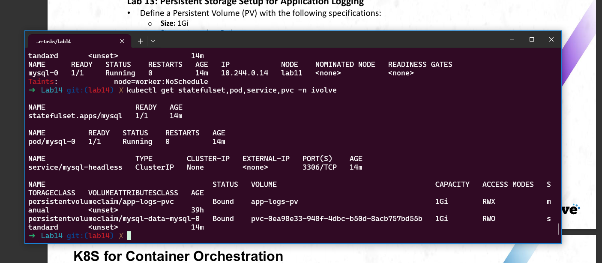

# Lab 14: StatefulSet with Headless Service

## Objective

This lab demonstrates how to deploy MySQL using a Kubernetes StatefulSet with persistent storage, a Headless Service, Kubernetes Secrets, and node taint toleration.

The lab includes:

- Creating a MySQL StatefulSet with one replica.
- Reading the MySQL root password from a Kubernetes Secret.
- Adding a toleration for the taint `node=worker:NoSchedule`.
- Creating a PersistentVolumeClaim for MySQL data.
- Mounting persistent storage at `/var/lib/mysql`.
- Creating a Headless Service using `clusterIP: None`.
- Connecting to MySQL and confirming that the database is operational.

---

## Prerequisites

The following tools are required:

- Docker
- Minikube
- kubectl

Verify the installed tools:

```bash
docker --version
minikube version
kubectl version --client
```

---

## Step 1: Start the Minikube Cluster

Start the existing Minikube cluster:

```bash
minikube start -p lab11 --driver=docker
```

Update the Kubernetes context:

```bash
minikube update-context -p lab11
```

Switch to the cluster context:

```bash
kubectl config use-context lab11
```

Verify the node:

```bash
kubectl get nodes
```

---

## Step 2: Verify the Namespace and Secret

Verify that the `ivolve` namespace exists:

```bash
kubectl get namespace ivolve
```

Verify the MySQL Secret:

```bash
kubectl get secret mysql-secret -n ivolve
```

Verify that the Secret contains the required key:

```bash
kubectl describe secret mysql-secret -n ivolve
```

The required Secret key is:

```text
MYSQL_ROOT_PASSWORD
```

---

## Step 3: Apply the Node Taint

Store the node name:

```bash
NODE_NAME=$(kubectl get nodes -o jsonpath='{.items[0].metadata.name}')
```

Apply the taint:

```bash
kubectl taint node "$NODE_NAME" node=worker:NoSchedule --overwrite
```

Verify the taint:

```bash
kubectl describe node "$NODE_NAME" | grep Taints
```

Expected result:

```text
Taints: node=worker:NoSchedule
```

---

## Step 4: Create the Headless Service

The Headless Service is defined in:

```text
mysql-headless-service.yaml
```

Manifest:

```yaml
apiVersion: v1
kind: Service
metadata:
  name: mysql-headless
  namespace: ivolve
spec:
  clusterIP: None
  selector:
    app: mysql
  ports:
    - name: mysql
      port: 3306
      targetPort: 3306
      protocol: TCP
```

Apply the Service:

```bash
kubectl apply -f mysql-headless-service.yaml
```

Verify it:

```bash
kubectl get service mysql-headless -n ivolve
```

Expected result:

```text
NAME             TYPE        CLUSTER-IP   PORT(S)
mysql-headless   ClusterIP   None         3306/TCP
```

---

## Step 5: Create the MySQL StatefulSet

The StatefulSet is defined in:

```text
mysql-statefulset.yaml
```

Important configuration:

```yaml
apiVersion: apps/v1
kind: StatefulSet
metadata:
  name: mysql
  namespace: ivolve
spec:
  serviceName: mysql-headless
  replicas: 1

  selector:
    matchLabels:
      app: mysql

  template:
    metadata:
      labels:
        app: mysql

    spec:
      tolerations:
        - key: node
          operator: Equal
          value: worker
          effect: NoSchedule

      containers:
        - name: mysql
          image: mysql:8.0

          ports:
            - name: mysql
              containerPort: 3306

          env:
            - name: MYSQL_ROOT_PASSWORD
              valueFrom:
                secretKeyRef:
                  name: mysql-secret
                  key: MYSQL_ROOT_PASSWORD

            - name: MYSQL_DATABASE
              value: ivolve

          volumeMounts:
            - name: mysql-data
              mountPath: /var/lib/mysql

  volumeClaimTemplates:
    - metadata:
        name: mysql-data
      spec:
        accessModes:
          - ReadWriteOnce
        resources:
          requests:
            storage: 1Gi
```

Apply the StatefulSet:

```bash
kubectl apply -f mysql-statefulset.yaml
```

Wait for the rollout:

```bash
kubectl rollout status statefulset/mysql \
  -n ivolve \
  --timeout=300s
```

Expected result:

```text
partitioned roll out complete
```

---

## Step 6: Verify Kubernetes Resources

Run:

```bash
kubectl get statefulset,pod,service,pvc -n ivolve
```

Expected result:

```text
StatefulSet: mysql              1/1
Pod: mysql-0                    Running
Service: mysql-headless         ClusterIP None
PVC: mysql-data-mysql-0         Bound
Storage: 1Gi
```

### Resources Status


---

## Step 7: Verify the Taint and Toleration

Verify the node taint:

```bash
kubectl describe nodes | grep -E "^Name:|^Taints:"
```

Verify the Pod tolerations:

```bash
kubectl get pod mysql-0 -n ivolve \
  -o jsonpath='{range .spec.tolerations[*]}Key={.key}, Value={.value}, Effect={.effect}{"\n"}{end}'
```

Expected values:

```text
Taint: node=worker:NoSchedule
Toleration Key: node
Toleration Value: worker
Toleration Effect: NoSchedule
```

### Taint and Toleration Verification



---

## Step 8: Verify the Secret and PVC Mount

Verify that the root password is consumed from the Secret:

```bash
kubectl get statefulset mysql -n ivolve \
  -o jsonpath='{.spec.template.spec.containers[0].env[?(@.name=="MYSQL_ROOT_PASSWORD")].valueFrom.secretKeyRef}{"\n"}'
```

Expected result:

```text
{"key":"MYSQL_ROOT_PASSWORD","name":"mysql-secret"}
```

Verify the storage mount:

```bash
kubectl get statefulset mysql -n ivolve \
  -o jsonpath='Mount Path: {.spec.template.spec.containers[0].volumeMounts[0].mountPath}{"\n"}'
```

Expected result:

```text
Mount Path: /var/lib/mysql
```

Verify the PVC:

```bash
kubectl get pvc mysql-data-mysql-0 -n ivolve
```

Expected result:

```text
mysql-data-mysql-0   Bound   1Gi   RWO
```

### Secret and PVC Mount Verification



---

## Step 9: Confirm MySQL Is Operational

Read the root password from the Kubernetes Secret:

```bash
MYSQL_ROOT_PASSWORD=$(
  kubectl get secret mysql-secret \
    -n ivolve \
    -o jsonpath='{.data.MYSQL_ROOT_PASSWORD}' |
  base64 --decode
)
```

Check MySQL health:

```bash
kubectl exec -n ivolve mysql-0 -- \
  mysqladmin ping \
  -uroot \
  -p"$MYSQL_ROOT_PASSWORD"
```

Expected result:

```text
mysqld is alive
```

Display the databases:

```bash
kubectl exec -n ivolve mysql-0 -- \
  mysql \
  -uroot \
  -p"$MYSQL_ROOT_PASSWORD" \
  -e "SHOW DATABASES;"
```

Expected databases include:

```text
information_schema
ivolve
mysql
performance_schema
sys
```

Run an operational test:

```bash
kubectl exec -n ivolve mysql-0 -- \
  mysql \
  -uroot \
  -p"$MYSQL_ROOT_PASSWORD" \
  -Divolve \
  -e "SELECT 'MySQL is operational' AS status;"
```

Expected result:

```text
status
MySQL is operational
```

### MySQL Operational Test



---

## Lab Overview



---

## Project Structure

```text
Lab14/
├── mysql-headless-service.yaml
├── mysql-statefulset.yaml
├── resources-status.png
├── taint-toleration.png
├── secret-pvc-mount.png
├── mysql-operational.png
├── lab14-overview.png
└── README.md
```

---

## Final Verification

Run:

```bash
kubectl get statefulset,pod,service,pvc -n ivolve
kubectl get pod mysql-0 -n ivolve -o wide
kubectl get service mysql-headless -n ivolve
kubectl describe nodes | grep -E "^Name:|^Taints:"
```

Final result:

```text
StatefulSet replicas: 1/1
MySQL Pod: Running
Headless Service: ClusterIP None
MySQL PVC: Bound
Storage size: 1Gi
Mount path: /var/lib/mysql
Toleration: node=worker:NoSchedule
MySQL database: Operational
```

---

## Cleanup

Delete the StatefulSet:

```bash
kubectl delete -f mysql-statefulset.yaml
```

Delete the Headless Service:

```bash
kubectl delete -f mysql-headless-service.yaml
```

Delete the PVC if needed:

```bash
kubectl delete pvc mysql-data-mysql-0 -n ivolve
```

Remove the node taint:

```bash
NODE_NAME=$(kubectl get nodes -o jsonpath='{.items[0].metadata.name}')

kubectl taint node "$NODE_NAME" node=worker:NoSchedule-
```

Stop the Minikube cluster:

```bash
minikube stop -p lab11
```

---

## Verification Checklist

- [x] Created a StatefulSet with one MySQL replica.
- [x] Created a Headless Service with `clusterIP: None`.
- [x] Consumed the root password from `mysql-secret`.
- [x] Added the `node=worker:NoSchedule` toleration.
- [x] Created a `1Gi` PersistentVolumeClaim.
- [x] Mounted the PVC at `/var/lib/mysql`.
- [x] Verified the StatefulSet is ready.
- [x] Verified the MySQL Pod is running.
- [x] Verified the PVC is bound.
- [x] Connected using a MySQL client.
- [x] Confirmed that the `ivolve` database is operational.
