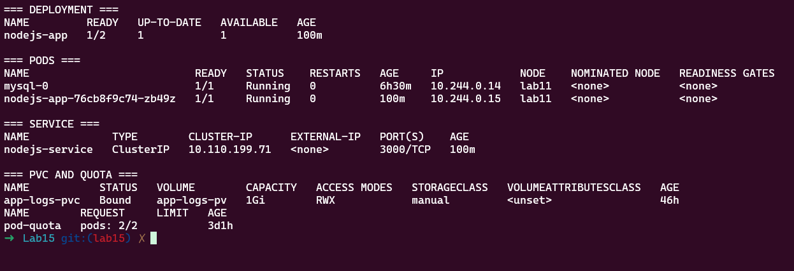
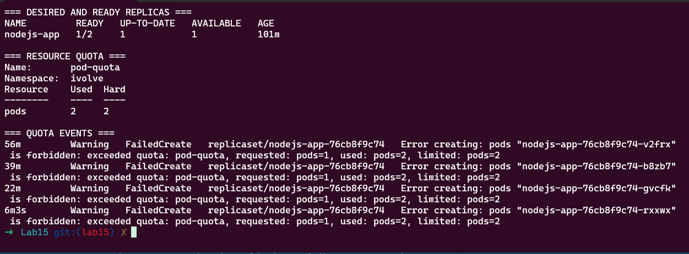
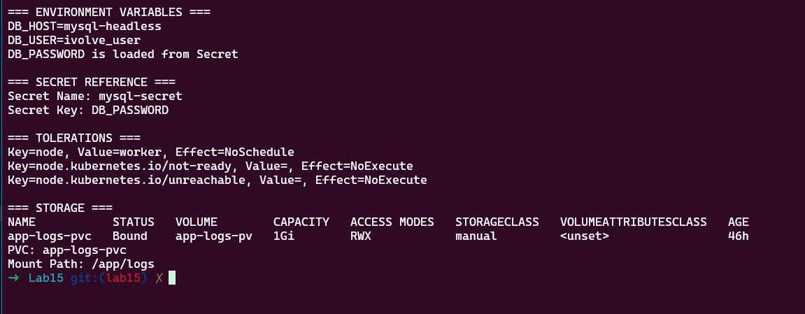
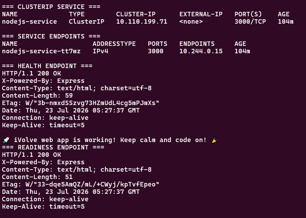

# Lab 15: Node.js Application Deployment with ClusterIP Service

## Objective

This lab deploys a Node.js application on Kubernetes using a Deployment and exposes it internally through a ClusterIP Service.

The implementation includes:

- A Deployment named `nodejs-app`.
- Two desired replicas, with only one application Pod running because of the namespace Pod quota.
- A custom Docker image from Docker Hub.
- Environment variables loaded from a ConfigMap and a Secret.
- A toleration for `node=worker:NoSchedule`.
- The static logging PVC mounted at `/app/logs`.
- A ClusterIP Service named `nodejs-service`.
- Health and readiness endpoint verification.

## Prerequisites

- Docker
- Minikube
- kubectl
- Existing namespace: `ivolve`
- Existing ConfigMap: `mysql-config`
- Existing Secret: `mysql-secret`
- Existing PVC: `app-logs-pvc`
- Existing MySQL StatefulSet and Headless Service

Verify the cluster:

```bash
minikube start -p lab11 --driver=docker
minikube update-context -p lab11
kubectl config use-context lab11
kubectl get nodes
```

## Existing Resources

Verify the required resources:

```bash
kubectl get namespace ivolve
kubectl get configmap mysql-config -n ivolve
kubectl get secret mysql-secret -n ivolve
kubectl get pvc app-logs-pvc -n ivolve
kubectl get service mysql-headless -n ivolve
```

The application uses:

```text
Docker image: mostafa760/ivolve-node-mysql:lab9
ConfigMap: mysql-config
Secret: mysql-secret
PVC: app-logs-pvc
Namespace: ivolve
```

## Node.js Deployment

The Deployment is stored in:

```text
nodejs-deployment.yaml
```

Important configuration:

```yaml
apiVersion: apps/v1
kind: Deployment
metadata:
  name: nodejs-app
  namespace: ivolve
spec:
  replicas: 2

  selector:
    matchLabels:
      app: nodejs-app

  template:
    metadata:
      labels:
        app: nodejs-app

    spec:
      tolerations:
        - key: node
          operator: Equal
          value: worker
          effect: NoSchedule

      containers:
        - name: nodejs-app
          image: mostafa760/ivolve-node-mysql:lab9

          ports:
            - containerPort: 3000

          envFrom:
            - configMapRef:
                name: mysql-config

          env:
            - name: DB_PASSWORD
              valueFrom:
                secretKeyRef:
                  name: mysql-secret
                  key: DB_PASSWORD

          volumeMounts:
            - name: app-logs
              mountPath: /app/logs

      volumes:
        - name: app-logs
          persistentVolumeClaim:
            claimName: app-logs-pvc
```

Apply the Deployment:

```bash
kubectl apply -f nodejs-deployment.yaml
```

## ClusterIP Service

The Service is stored in:

```text
nodejs-service.yaml
```

Manifest:

```yaml
apiVersion: v1
kind: Service
metadata:
  name: nodejs-service
  namespace: ivolve
spec:
  type: ClusterIP

  selector:
    app: nodejs-app

  ports:
    - name: http
      protocol: TCP
      port: 3000
      targetPort: 3000
```

Apply the Service:

```bash
kubectl apply -f nodejs-service.yaml
```

## Verify Deployment Status

```bash
kubectl get deployment nodejs-app -n ivolve
kubectl get pods -n ivolve -o wide
```

Observed result:

```text
Deployment desired replicas: 2
Deployment ready replicas: 1
MySQL Pod: Running
Node.js Pod: Running
```

Only one Node.js Pod runs because the `ivolve` namespace quota allows a maximum of two Pods:

```text
mysql-0 = first Pod
nodejs-app Pod = second Pod
Pod quota = 2
```

### Resources Status



## Verify ResourceQuota Enforcement

```bash
kubectl get resourcequota pod-quota -n ivolve

kubectl get events -n ivolve \
  --sort-by='.lastTimestamp' |
  grep -E 'FailedCreate|exceeded quota' |
  tail -n 10
```

Expected quota usage:

```text
pods: 2/2
```

The second Node.js replica cannot be created because the namespace already uses its two allowed Pods.

### Quota Enforcement



## Verify ConfigMap, Secret, Toleration and Storage

Get the running Node.js Pod name:

```bash
NODEJS_POD=$(
  kubectl get pods \
    -n ivolve \
    -l app=nodejs-app \
    -o jsonpath='{.items[0].metadata.name}'
)

echo "$NODEJS_POD"
```

Verify ConfigMap values and Secret loading without displaying the password:

```bash
kubectl exec -n ivolve "$NODEJS_POD" -- \
  sh -c '
    echo "DB_HOST=$DB_HOST"
    echo "DB_USER=$DB_USER"

    if [ -n "$DB_PASSWORD" ]; then
      echo "DB_PASSWORD is loaded from Secret"
    fi
  '
```

Verify the Secret reference:

```bash
kubectl get deployment nodejs-app -n ivolve \
  -o jsonpath='Secret Name: {.spec.template.spec.containers[0].env[0].valueFrom.secretKeyRef.name}{"\n"}Secret Key: {.spec.template.spec.containers[0].env[0].valueFrom.secretKeyRef.key}{"\n"}'
```

Verify the toleration:

```bash
kubectl get pod "$NODEJS_POD" -n ivolve \
  -o jsonpath='{range .spec.tolerations[*]}Key={.key}, Value={.value}, Effect={.effect}{"\n"}{end}'
```

Expected toleration:

```text
Key=node, Value=worker, Effect=NoSchedule
```

Verify the PVC and mount path:

```bash
kubectl get pvc app-logs-pvc -n ivolve

kubectl get deployment nodejs-app -n ivolve \
  -o jsonpath='PVC: {.spec.template.spec.volumes[0].persistentVolumeClaim.claimName}{"\n"}Mount Path: {.spec.template.spec.containers[0].volumeMounts[0].mountPath}{"\n"}'
```

Expected values:

```text
PVC: app-logs-pvc
Mount Path: /app/logs
PVC status: Bound
```

### Configuration, Secret, Toleration and Storage



## Verify ClusterIP Service

```bash
kubectl get service nodejs-service -n ivolve

kubectl get endpointslices \
  -n ivolve \
  -l kubernetes.io/service-name=nodejs-service
```

Observed result:

```text
Service type: ClusterIP
Service port: 3000
Available endpoint: one Node.js Pod
```

The Service can balance traffic across all ready application Pods. In this lab, only one endpoint is available because the Pod quota prevents the second replica from being created.

## Test the Application

Start port forwarding:

```bash
kubectl port-forward \
  service/nodejs-service \
  3002:3000 \
  -n ivolve
```

Keep that terminal open. In another terminal, run:

```bash
curl -i http://localhost:3002
curl -i http://localhost:3002/health
curl -i http://localhost:3002/ready
```

Expected response:

```text
HTTP/1.1 200 OK
```

Stop port forwarding with:

```text
Ctrl + C
```

### Service and Health Verification



## Verify Persistent Logs

After sending requests to the application:

```bash
kubectl exec -n ivolve "$NODEJS_POD" -- \
  ls -lah /app/logs

kubectl exec -n ivolve "$NODEJS_POD" -- \
  tail -n 20 /app/logs/access.log
```

Verify the same log file on the Minikube node:

```bash
minikube ssh -p lab11 -- \
  "sudo tail -n 20 /mnt/app-logs/access.log"
```

## Final Verification

```bash
kubectl get deployment nodejs-app -n ivolve
kubectl get pods -n ivolve -o wide
kubectl get service nodejs-service -n ivolve
kubectl get resourcequota pod-quota -n ivolve
kubectl get pvc app-logs-pvc -n ivolve
```

Final result:

```text
Deployment: nodejs-app
Desired replicas: 2
Ready replicas: 1
Application Pod: Running
MySQL Pod: Running
ClusterIP Service: nodejs-service
Service port: 3000
ResourceQuota usage: 2/2
PVC: app-logs-pvc Bound
Log mount: /app/logs
Toleration: node=worker:NoSchedule
```

## Project Structure

```text
Lab15/
├── nodejs-deployment.yaml
├── nodejs-service.yaml
├── screenshots/
│   ├── 01-resources-status.png
│   ├── 02-quota-enforcement.png
│   ├── 03-config-secret-storage.png
│   └── 04-service-health.png
└── README.md
```

## Cleanup

Delete the application resources:

```bash
kubectl delete -f nodejs-deployment.yaml
kubectl delete -f nodejs-service.yaml
```

Stop the Minikube cluster:

```bash
minikube stop -p lab11
```

## Verification Checklist

- [x] Created the `nodejs-app` Deployment.
- [x] Configured two desired replicas.
- [x] Verified that one application Pod is running.
- [x] Used the custom Docker Hub image.
- [x] Loaded configuration from `mysql-config`.
- [x] Loaded `DB_PASSWORD` from `mysql-secret`.
- [x] Added the `node=worker:NoSchedule` toleration.
- [x] Mounted `app-logs-pvc` at `/app/logs`.
- [x] Created the `nodejs-service` ClusterIP Service.
- [x] Verified the Service endpoint.
- [x] Verified `/health` and `/ready`.
- [x] Verified Pod quota usage as `2/2`.
