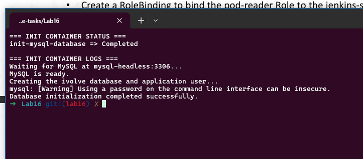
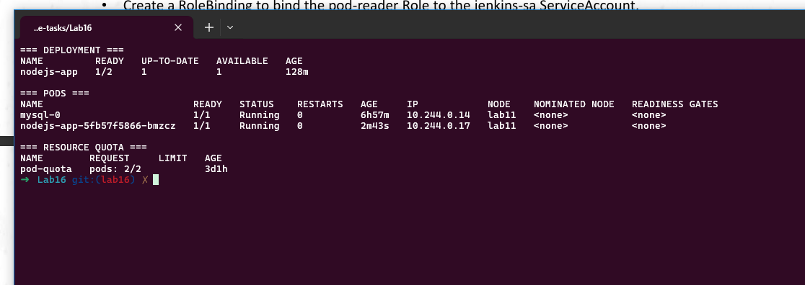
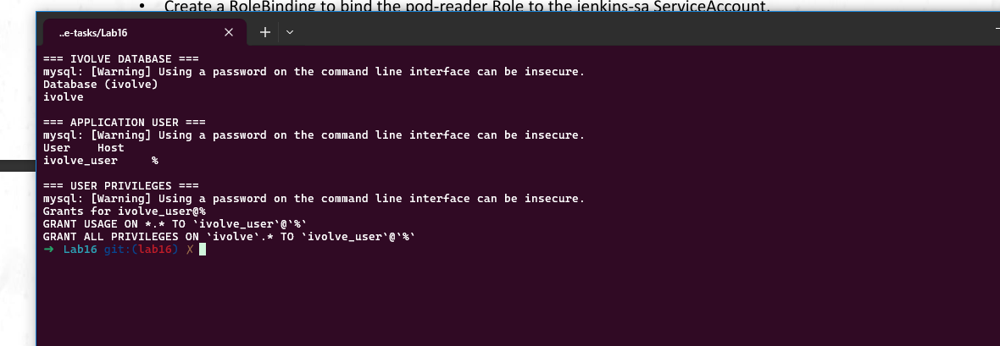
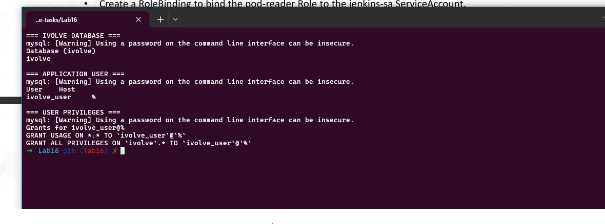

# Lab 16: Kubernetes Init Container for Pre-Deployment Database Setup

## Objective

This lab modifies the existing `nodejs-app` Deployment to use an Init Container before the Node.js application starts.

The Init Container:

- Uses a MySQL client image.
- Loads database connection values from `mysql-config` and `mysql-secret`.
- Waits until MySQL is available.
- Creates the `ivolve` database if it does not already exist.
- Creates or updates the application database user.
- Grants the application user all privileges on the `ivolve` database.
- Completes successfully before the main Node.js container starts.

## Prerequisites

The following Kubernetes resources must already exist:

- Namespace: `ivolve`
- Deployment: `nodejs-app`
- StatefulSet: `mysql`
- MySQL Pod: `mysql-0`
- Headless Service: `mysql-headless`
- ConfigMap: `mysql-config`
- Secret: `mysql-secret`
- PVC: `app-logs-pvc`

Verify the cluster:

```bash
minikube start -p lab11 --driver=docker
minikube update-context -p lab11
kubectl config use-context lab11
kubectl get nodes
```

Verify the required resources:

```bash
kubectl get namespace ivolve
kubectl get configmap mysql-config -n ivolve
kubectl get secret mysql-secret -n ivolve
kubectl get statefulset mysql -n ivolve
kubectl get service mysql-headless -n ivolve
kubectl get deployment nodejs-app -n ivolve
```

## Deployment Manifest

The modified Deployment is stored in:

```text
nodejs-deployment.yaml
```

The Deployment contains an Init Container named:

```text
init-mysql-database
```

Important Init Container configuration:

```yaml
initContainers:
  - name: init-mysql-database
    image: mysql:8.0
    imagePullPolicy: IfNotPresent

    command:
      - sh
      - -c

    args:
      - |
        set -eu

        echo "Waiting for MySQL at ${DB_HOST}:3306..."

        until mysql \
          --protocol=TCP \
          -h "${DB_HOST}" \
          -P 3306 \
          -u root \
          -p"${MYSQL_ROOT_PASSWORD}" \
          -e "SELECT 1;" >/dev/null 2>&1
        do
          echo "MySQL is not ready yet..."
          sleep 3
        done

        mysql \
          --protocol=TCP \
          -h "${DB_HOST}" \
          -P 3306 \
          -u root \
          -p"${MYSQL_ROOT_PASSWORD}" <<SQL
        CREATE DATABASE IF NOT EXISTS \`ivolve\`;

        CREATE USER IF NOT EXISTS
          '${DB_USER}'@'%'
          IDENTIFIED BY '${DB_PASSWORD}';

        ALTER USER
          '${DB_USER}'@'%'
          IDENTIFIED BY '${DB_PASSWORD}';

        GRANT ALL PRIVILEGES
          ON \`ivolve\`.*
          TO '${DB_USER}'@'%';

        FLUSH PRIVILEGES;
        SQL

        echo "Database initialization completed successfully."
```

The Init Container receives configuration from the ConfigMap and Secret:

```yaml
env:
  - name: DB_HOST
    valueFrom:
      configMapKeyRef:
        name: mysql-config
        key: DB_HOST

  - name: DB_USER
    valueFrom:
      configMapKeyRef:
        name: mysql-config
        key: DB_USER

  - name: DB_PASSWORD
    valueFrom:
      secretKeyRef:
        name: mysql-secret
        key: DB_PASSWORD

  - name: MYSQL_ROOT_PASSWORD
    valueFrom:
      secretKeyRef:
        name: mysql-secret
        key: MYSQL_ROOT_PASSWORD
```

## Apply the Deployment

Validate the manifest:

```bash
kubectl apply \
  --dry-run=client \
  -f nodejs-deployment.yaml
```

Apply the Deployment:

```bash
kubectl apply -f nodejs-deployment.yaml
```

Watch the Pod lifecycle:

```bash
kubectl get pods -n ivolve -w
```

The Node.js Pod should pass through stages similar to:

```text
Init:0/1
PodInitializing
Running
```

## Get the Node.js Pod Name

```bash
NODEJS_POD=$(
  kubectl get pods \
    -n ivolve \
    -l app=nodejs-app \
    -o jsonpath='{.items[0].metadata.name}'
)

echo "$NODEJS_POD"
```

## Verify the Init Container

View the Init Container logs:

```bash
kubectl logs \
  -n ivolve \
  "$NODEJS_POD" \
  -c init-mysql-database
```

Expected output:

```text
Waiting for MySQL at mysql-headless:3306...
MySQL is ready.
Creating the ivolve database and application user...
Database initialization completed successfully.
```

Verify that the Init Container completed successfully:

```bash
kubectl get pod "$NODEJS_POD" \
  -n ivolve \
  -o jsonpath='{.status.initContainerStatuses[0].name}{" => "}{.status.initContainerStatuses[0].state.terminated.reason}{"\n"}'
```

Expected result:

```text
init-mysql-database => Completed
```

### Init Container Verification



## Verify Deployment and Pod Status

```bash
kubectl get deployment nodejs-app -n ivolve
kubectl get pods -n ivolve -o wide
kubectl get resourcequota pod-quota -n ivolve
```

Expected result:

```text
Deployment desired replicas: 2
Deployment ready replicas: 1
MySQL Pod: Running
Node.js Pod: Running
ResourceQuota: pods 2/2
```

Only one Node.js Pod runs because the namespace quota allows two Pods total, and one Pod is already used by MySQL.

### Deployment Status



## Verify the Database and User

Load the required values:

```bash
MYSQL_ROOT_PASSWORD=$(
  kubectl get secret mysql-secret \
    -n ivolve \
    -o jsonpath='{.data.MYSQL_ROOT_PASSWORD}' |
  base64 --decode
)

DB_USER=$(
  kubectl get configmap mysql-config \
    -n ivolve \
    -o jsonpath='{.data.DB_USER}'
)
```

Verify the `ivolve` database:

```bash
kubectl exec -n ivolve mysql-0 -- \
  mysql \
  -uroot \
  -p"$MYSQL_ROOT_PASSWORD" \
  -e "SHOW DATABASES LIKE 'ivolve';"
```

Verify the application user:

```bash
kubectl exec -n ivolve mysql-0 -- \
  mysql \
  -uroot \
  -p"$MYSQL_ROOT_PASSWORD" \
  -e "
    SELECT User, Host
    FROM mysql.user
    WHERE User = '${DB_USER}';
  "
```

Verify the user privileges:

```bash
kubectl exec -n ivolve mysql-0 -- \
  mysql \
  -uroot \
  -p"$MYSQL_ROOT_PASSWORD" \
  -e "SHOW GRANTS FOR '${DB_USER}'@'%';"
```

Expected privilege:

```text
GRANT ALL PRIVILEGES ON `ivolve`.* TO `ivolve_user`@`%`
```

### Database, User and Privileges



## Connect Using the Application User

Load the application password:

```bash
DB_PASSWORD=$(
  kubectl get secret mysql-secret \
    -n ivolve \
    -o jsonpath='{.data.DB_PASSWORD}' |
  base64 --decode
)
```

Connect using the application user:

```bash
kubectl exec -n ivolve mysql-0 -- \
  mysql \
  --protocol=TCP \
  -h mysql-headless \
  -u"$DB_USER" \
  -p"$DB_PASSWORD" \
  -Divolve \
  -e "
    SELECT CURRENT_USER() AS connected_user;
    SELECT DATABASE() AS current_database;
  "
```

Expected result:

```text
connected_user
ivolve_user@%

current_database
ivolve
```

Verify write privileges:

```bash
kubectl exec -n ivolve mysql-0 -- \
  mysql \
  --protocol=TCP \
  -h mysql-headless \
  -u"$DB_USER" \
  -p"$DB_PASSWORD" \
  -Divolve \
  -e "
    CREATE TABLE IF NOT EXISTS lab16_verification (
      id INT PRIMARY KEY,
      message VARCHAR(100)
    );

    INSERT INTO lab16_verification
      (id, message)
    VALUES
      (1, 'Init container configured the database')
    ON DUPLICATE KEY UPDATE
      message = VALUES(message);

    SELECT * FROM lab16_verification;
  "
```

Expected result:

```text
id   message
1    Init container configured the database
```

### Application User Connection Test



## Verify Init Container Configuration

Display the Init Container name:

```bash
kubectl get deployment nodejs-app \
  -n ivolve \
  -o jsonpath='{.spec.template.spec.initContainers[0].name}{"\n"}'
```

Display the Init Container image:

```bash
kubectl get deployment nodejs-app \
  -n ivolve \
  -o jsonpath='{.spec.template.spec.initContainers[0].image}{"\n"}'
```

Display the environment variable sources:

```bash
kubectl get deployment nodejs-app \
  -n ivolve \
  -o jsonpath='{range .spec.template.spec.initContainers[0].env[*]}{.name}{" => ConfigMap: "}{.valueFrom.configMapKeyRef.name}{.valueFrom.configMapKeyRef.key}{" Secret: "}{.valueFrom.secretKeyRef.name}{.valueFrom.secretKeyRef.key}{"\n"}{end}'
```

## Project Structure

```text
Lab16/
├── nodejs-deployment.yaml
├── screenshots/
│   ├── 01-init-container.png
│   ├── 02-deployment-status.png
│   ├── 03-database-privileges.png
│   └── 04-app-user-test.png
└── README.md
```

## Final Verification

```bash
kubectl get deployment nodejs-app -n ivolve
kubectl get pods -n ivolve
kubectl get resourcequota pod-quota -n ivolve

kubectl get pod "$NODEJS_POD" \
  -n ivolve \
  -o jsonpath='{.status.initContainerStatuses[0].name}{" => "}{.status.initContainerStatuses[0].state.terminated.reason}{"\n"}'
```

Final result:

```text
Init Container: Completed
Database: ivolve exists
Application user: exists
Privileges: ALL on ivolve.*
Node.js Pod: Running
MySQL Pod: Running
```

## Troubleshooting

If the Pod is in `Init:Error` or `Init:CrashLoopBackOff`, run:

```bash
kubectl describe pod "$NODEJS_POD" -n ivolve

kubectl logs \
  -n ivolve \
  "$NODEJS_POD" \
  -c init-mysql-database
```

If the root account cannot connect through the MySQL Service, verify the MySQL root user and networking configuration.

## Cleanup

Delete the Node.js Deployment:

```bash
kubectl delete -f nodejs-deployment.yaml
```

Stop the Minikube cluster:

```bash
minikube stop -p lab11
```

## Verification Checklist

- [x] Modified the existing Node.js Deployment.
- [x] Added a MySQL client Init Container.
- [x] Loaded DB configuration from `mysql-config`.
- [x] Loaded credentials from `mysql-secret`.
- [x] Waited for MySQL before database setup.
- [x] Created the `ivolve` database.
- [x] Created or updated the application user.
- [x] Granted all privileges on `ivolve.*`.
- [x] Verified the Init Container completed.
- [x] Verified the database manually.
- [x] Verified the user manually.
- [x] Verified the expected privileges.
- [x] Connected using the application user.
- [x] Verified write access.
