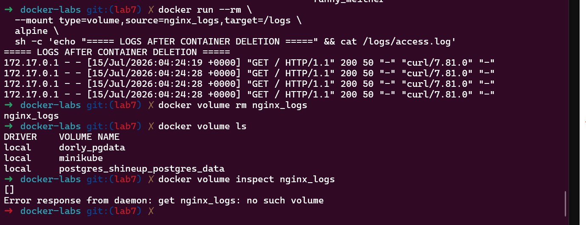

# Lab 2: Building and Packaging Java Application with Maven

## Overview

This lab demonstrates how to build, test, and package a Java application using Apache Maven.

The objectives of this lab are:

* Install and configure Maven
* Clone a Java Maven project
* Run unit tests
* Build the application
* Generate a JAR artifact
* Run and verify the application

---

## Technologies Used

* Java
* Apache Maven
* Git

---

## Project Setup

Clone the source code repository:

```bash
git clone https://github.com/Ibrahim-Adel15/calculator-maven.git
```

Navigate to the project directory:

```bash
cd calculator-maven
```

Check project files:

```bash
ls
```

Project structure:

```
calculator-maven
|
|-- pom.xml
|
|-- src
    |
    |-- main
    |
    |-- test
```

---

## Install Maven

Check Java installation:

```bash
java -version
```

Install Maven:

```bash
sudo apt update
sudo apt install maven -y
```

Verify Maven installation:

```bash
mvn -version
```

---

## Run Unit Tests

Execute the project tests:

```bash
mvn test
```

Successful execution should display:

```
BUILD SUCCESS
```

Unit tests verify that the calculator functions work correctly before creating the application package.

---

## Build Application

Package the application using Maven:

```bash
mvn package
```

Maven performs the following tasks:

* Compile Java source code
* Run unit tests
* Package the application
* Generate the JAR artifact

After a successful build, check the target directory:

```bash
ls target
```

The generated artifact:

```
target/calculator.jar
```

---

## Run Application

Execute the generated JAR file:

```bash
java -jar target/calculator.jar
```

The calculator application will start and accept user input.

---

## Verify Application

Test the application by providing input values and checking the output.

Example:

```
Enter first number:
10

Enter second number:
5

Result:
15
```

---

## Maven Commands Summary

| Command        | Description                  |
| -------------- | ---------------------------- |
| `mvn test`     | Run unit tests               |
| `mvn package`  | Build and generate JAR file  |
| `mvn clean`    | Remove generated build files |
| `mvn -version` | Check Maven installation     |

---

## Clean Build Files

To remove generated files:

```bash
mvn clean
```

---

## Conclusion

This lab demonstrates how Maven can be used to manage a Java project lifecycle, including testing, building, packaging, and running a Java application using a generated JAR artifact.
# Lab 7: Docker Volume and Bind Mount with Nginx

## Objective

Use a Docker Volume to persist Nginx logs and a Bind Mount to serve a custom HTML page from the host machine.

## Project Structure

```text
Lab7/
└── docker-labs/
    └── nginx-bind/
        └── html/
            ├── index.html
            ├── 1.PNG
            └── README.md
```

> Run the following commands from the `Lab7/docker-labs` directory.

## 1. Create the HTML File

```bash
mkdir -p nginx-bind/html
echo '<h1>Hello from Bind Mount</h1>' > nginx-bind/html/index.html
```

## 2. Create and Inspect the Volume

```bash
docker volume create nginx_logs
docker volume ls
docker volume inspect nginx_logs
```

## 3. Run the Nginx Container

```bash
docker run -d \
  --name nginx-lab \
  -p 8080:80 \
  --mount type=volume,source=nginx_logs,target=/var/log/nginx \
  --mount type=bind,source="$(pwd)/nginx-bind/html",target=/usr/share/nginx/html,readonly \
  nginx:latest
```

## 4. Test the Page

```bash
curl http://localhost:8080
```

Expected output:

```html
<h1>Hello from Bind Mount</h1>
```

## 5. Update the Host File

```bash
echo '<h1>Hello after changing the Bind Mount file</h1>' > nginx-bind/html/index.html
curl http://localhost:8080
```

The updated content appears immediately without restarting the container.

## 6. Verify Log Persistence

```bash
docker rm -f nginx-lab

docker run --rm \
  --mount type=volume,source=nginx_logs,target=/logs \
  alpine \
  sh -c 'cat /logs/access.log'
```

The logs remain available after deleting the Nginx container.

## 7. Delete the Volume

```bash
docker volume rm nginx_logs
docker volume ls
```

## Result

- The custom page was served successfully.
- Bind Mount changes appeared immediately.
- Nginx logs persisted in the Docker Volume.
- The volume was deleted successfully.

## Screenshot

