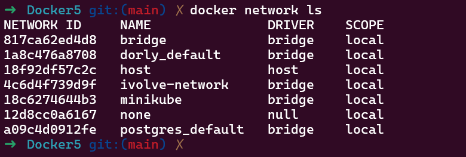

# Lab 8: Custom Docker Network for Microservices

## Objective

Build Docker images for a Python frontend and backend, connect them using a custom Docker network, and verify communication between containers on the same and different networks.

## Project Structure

```text
Docker5/
├── backend/
│   ├── app.py
│   └── Dockerfile
├── frontend/
│   ├── app.py
│   ├── Dockerfile
│   └── requirements.txt
├── ivolve-network.PNG
├── ivolve-Could not connect to backend..PNG
└── README.md
```

## 1. Frontend Dockerfile

```dockerfile
FROM python:3.12-slim

WORKDIR /app

COPY requirements.txt .

RUN pip install --no-cache-dir -r requirements.txt

COPY app.py .

EXPOSE 5000

CMD ["python", "app.py"]
```

## 2. Backend Dockerfile

```dockerfile
FROM python:3.12-slim

WORKDIR /app

RUN pip install --no-cache-dir flask

COPY app.py .

EXPOSE 5000

CMD ["python", "app.py"]
```

## 3. Build the Images

Run these commands from the `Docker5` directory:

```bash
docker build -t frontend-image ./frontend
docker build -t backend-image ./backend
```

Verify the images:

```bash
docker image ls
```

## 4. Create the Custom Network

```bash
docker network create ivolve-network
docker network ls
```

## 5. Run the Containers

Run the backend on the custom network:

```bash
docker run -d   --name backend   --network ivolve-network   -p 5000:5000   backend-image
```

Run `frontend1` on the same custom network:

```bash
docker run -d   --name frontend1   --network ivolve-network   -p 5001:5000   frontend-image
```

Run `frontend2` on the default bridge network:

```bash
docker run -d   --name frontend2   -p 5002:5000   frontend-image
```

## 6. Verify Communication

Test `frontend1`:

```bash
curl http://localhost:5001
```

`frontend1` can communicate with the backend because both containers use `ivolve-network`.

Test `frontend2`:

```bash
curl http://localhost:5002
```

Expected result:

```text
Could not connect to backend.
```

`frontend2` cannot communicate with the backend because it uses the default bridge network.

Inspect the custom network:

```bash
docker network inspect ivolve-network
```

The output should show both `backend` and `frontend1`.

## Screenshots

### Containers on `ivolve-network`



### Frontend on the Default Network


## 7. Clean Up

Remove the containers:

```bash
docker rm -f backend frontend1 frontend2
```

Delete the custom network:

```bash
docker network rm ivolve-network
```

Verify deletion:

```bash
docker network ls
```

## Result

- The frontend and backend images were built successfully.
- `backend` and `frontend1` communicated over `ivolve-network`.
- `frontend2` could not reach the backend from the default network.
- The custom Docker network was deleted successfully.